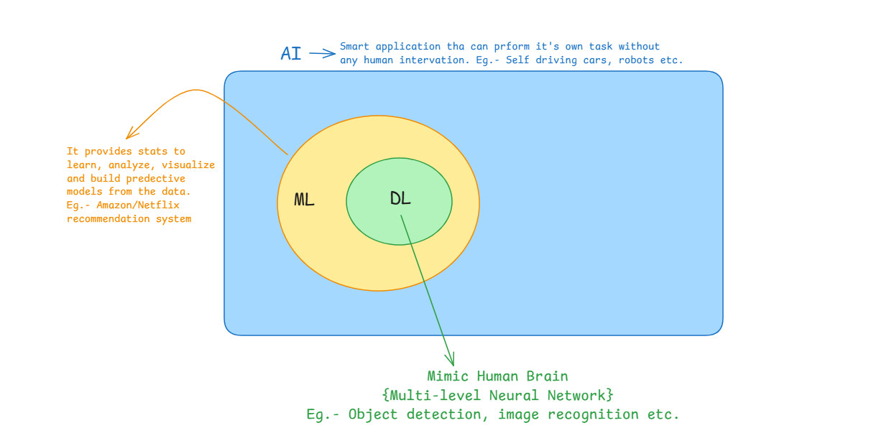

### AI vs ML Vs DL vs DS :-
- `AI (Artificial Intelligence)` is a broad field that deals with creating machines that can perform tasks that typically require human intelligence. It involves developing algorithms and statistical models that enable machines to learn from data, reason, and interact with the environment.

- `ML (Machine Learning)` is a subset of AI that focuses on developing algorithms and statistical models that enable machines to learn from data, without being explicitly programmed. It involves training models on data to make predictions or decisions. 

- `DL (Deep Learning)` is a subset of ML that uses neural networks with multiple layers to analyze data. It is particularly useful for image and speech recognition, natural language processing, and other applications where complex patterns need to be identified.

- `DS (Data Science)` is a field that deals with extracting insights and knowledge from data. It involves collecting, processing, and analyzing data to answer business questions, solve problems, or make informed decisions. While DS often involves ML and DL, it is a broader field that encompasses data wrangling , visualization, and communication of results. 

## Types of Machine Learning Models:
1. **Supervised Learning**: In this type of learning, the model is trained on labeled data, where the correct output is already known. The model learns to map inputs to outputs based on the labeled data . Examples include image classification, sentiment analysis, and regression.

2. **Unsupervised Learning**: In this type of learning, the model is trained on unlabeled data, and it must find patterns or structure in the data on its own. Examples include clustering , dimensionality reduction, and anomaly detection. 

3. **Semi-Supervised Learning**: In this type of learning, the model is trained on a combination of labeled and unlabeled data. It can leverage the labeled data to improve its performance on the unlabeled data. Examples include semi-supervised clustering and semi-supervised classification. 

4. **Reinforcement Learning**: In this type of learning, the model learns by interacting with an environment and receiving feedback in the form of rewards or penalties. Examples include game playing, robotics, and recommendation systems.

## Dataset :-
A dataset is a collection of data that is used to train, test, and evaluate machine learning models . It typically consists of features (input variables) and a target variable (output variable). The quality and size of the dataset can significantly impact the performance of the model. 

It can be classified into 3 parts-
1. **Training Set**: This is the part of the dataset used to train the model. It is typically 70-80% of the total dataset. 

2. **Validation Set**: This is the part of the dataset used to evaluate the model's performance during training. It is typically 10-20% of the total dataset.

3. **Test Set**: This is the part of the dataset used to evaluate the model's performance after training. It is typically 10-20% of the total dataset. 

